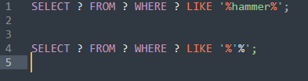

# SQL
SQL Injections

## Breif Disclaimer:
I did not make a demo for this because it's pretty much running in my head so bare with me. I am trying to make it as detailed as possible so you can grasp the concept and idea that I'm trying to show. 

At this point everyone should have a general idea of SQL and databases from DR. Cox class, so I will be skipping the introduction of SQL and going stright in to the attack it self, and it's break downs.

## Behind the Scenes of SQL Attacks

Scenario:
You go into a website and there is a search form. The key word that you put into that form goes into a php server which then constructs a SQL query that says give me any rows that have the key word in them. From there it goes into the database asking for all those rows with your intended key word; afterwards it spits them back out to the screen.

 * What happens when you give that key word a special SQL command?
When you do that the server will read the key word as instructed, but it also read the specal SQL command as second query. That is bad or a no no.

How would we go about this normally?

Start by seeing if there is any vulberabilites. Now you can use the tools kali gives for website vulnerability or you can go in manually. In this case I would do it manually first. The first thing I would do is put in a single quote (`'`) and see what it says. It is important to note what the error message will say, it can be a range of messages like `Invalid Search`, or might give you a error code, and even `Sever Error. We apologise for the inconvenience`. Notice the last two I said; companies will make their life easier and create error codes that tell the technian where the problem is, or it will flat out say it that there is a `Sever Error`. You might be thinking to yourself oh well this is bad cause it doesn't show if there is a vulnerability. WRONG!!!! There is one and it was put right in front of you.

The one who is in the wrong is the company or their site beacuse that small detail shouldn't be showing up at all in the end-user side. When that single quote `'` is being sanitized through the php server, it shouldn't have been read ever as a control structure, but as a charcter for a item in the list. 

### What Should We Do to Attack This?

Let's first break down what first happened. The query was searching for a specific key word within the database, lets go with ` hammer ` for example. Now when its going through the process the query line in the backend of the databse will look something like this, ` SELECT (something) FROM (some table within the database) WHERE (some column) LIKE '%hammer% ; ` ,(Quick challenge if anyone could tell me what anwser me these two things gets brownie points. 1) What is the purpose of `%`? 2) If I were to put in `ammer` in the search form, would it work? and why?), now I could be wrong about the query line however its just some generic one I came up with for understanding purposes.

So from looking at that one query there is one thing that stands out, which is we are able to control one thing, the key word that is being search for. Now lets go back to the single quote `'`. In the picture below you see two queries. Pay attention to the second query, notice something different? Yes the first `%` is inside what it thinks is a proper string but the second one outside of it is not longer in a proper string. Hence the sever error from the beginning. Interesting enough that one single quote will break SQL sending a malformed query to the php server. 

Now the question then becomes what do we change the single quote into to really get information out of this. 

